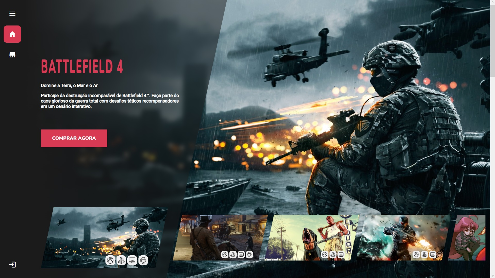
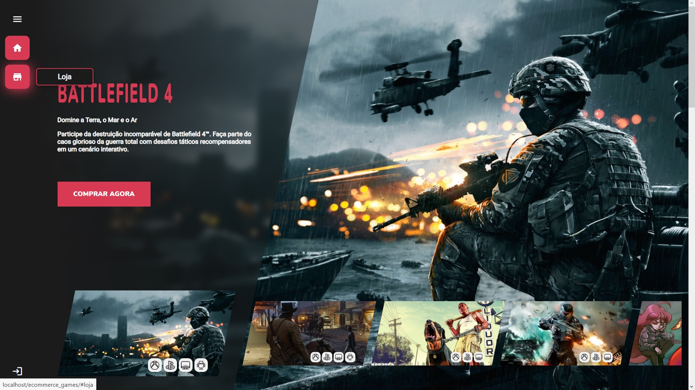
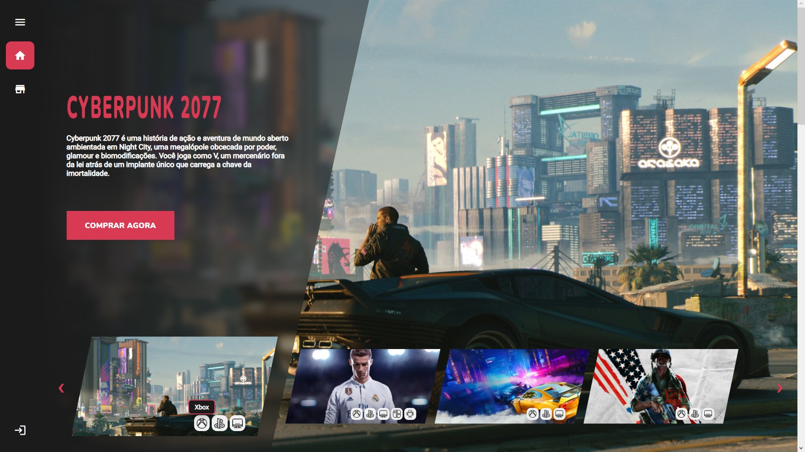
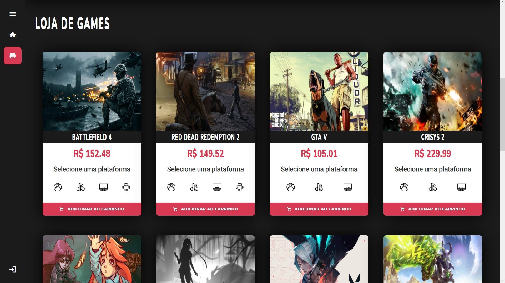
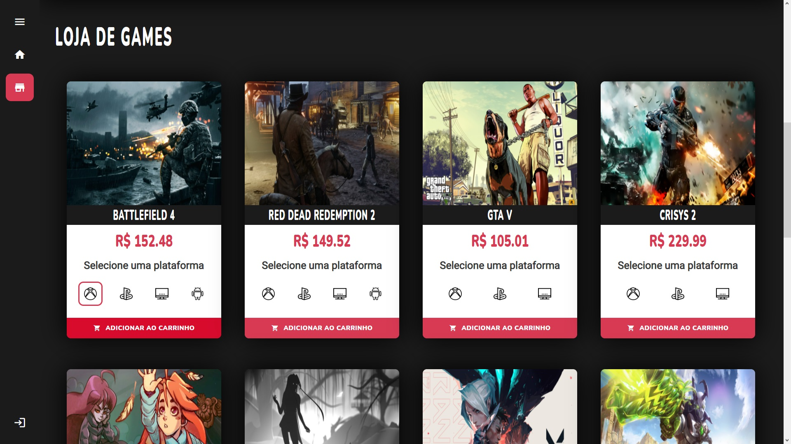
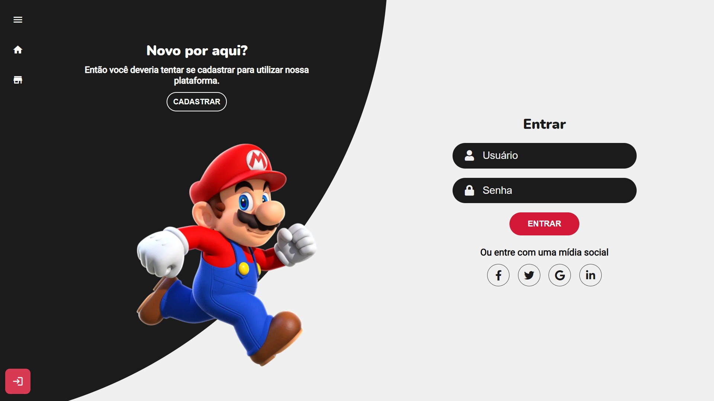
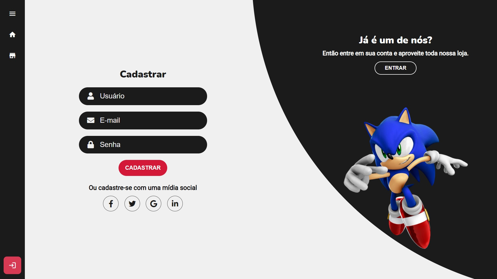

<h1>E-commerceGames</h1>

  <h2>Sumário</h2>
    <ul>
      <li><a href="#sobre">Sobre</a></li>
      <li><a href="#requisitos">Pré-requisitos</a></li>
      <li><a href="#instalacao">Rodando a aplicação</a></li>
      <li><a href="#galeria">Galeria</a></li>
      <li><a href="#nota">Notas</a></li>
    </ul>
    
  <h2 id='sobre'>💬 Sobre</h2>
  
Este website foi feito com o intuito de colocar em prática os conhecimentos adquiridos por mim ao longo de meus estudos na área da programação. O projeto consiste em um E-commerce para venda de jogos, utilizando os recursos de Login e Cadastro de usuários, Sessions (PHP), MySQL, JavaScript, HTML, CSS.

  
  <h2 id='requisitos'>🧩 Pré-requisitos para rodar a aplicação</h2>
  
Tenha certeza de que seu dispositivo tem o xampp instalado senão instale-o no link:

  <ul><a href="https://www.apachefriends.org/pt_br/download.html">https://www.apachefriends.org/pt_br/download.html</a></ul>
  
Após a instalação do xampp, siga os seguintes passos para importar o banco de dados:

  <ul>
    <li>Abra o XAMPP Control Panel em seu dispositivo;</li>
    <li>Inicie o Apache e o MySQL;</li>
    <li>Em seu navegador, entre no link "localhost/phpmyadmin";</li>
    <li>Crie um novo banco de dados chamado "bd_ecommerce_games";</li>
    <li>Na parte superior da página, clique em "Importar";</li>
    <li>Clique no botão "Procurar..." e selecione o banco de dados localizado na Pasta "..\E_commerceGames-master\bd\bd_ecommerce_games.sql" do arquivo baixado;</li>
    <li>Desça a página e clique no botão "Executar".</li>
  </ul>
  
  <h2 id='instalacao'>🚀 Rodando a Aplicação</h2>
  
  
Depois de configurar o Banco de dados em sua máquina, mova a pasta raiz do projeto para a pasta "htdocs" do Xampp, localizada por padrão em "C:\xampp\htdocs\" e, em seguida, abra o link "localhost/E-commerceGames-master" em seu navegador.

  
Tudo pronto! O projeto já estará rodando no localhost de seu dispositivo, agora é só aproveitar e vizualizar todos os recursos presentes nele.

  
  <h2 id='galeria'>🖼 Galeria</h2>
  
Página inicial

  
  
  
  
  
Loja de jogos

  
  
  
  
  
Login e Cadastro

  
  
  
  <h2 id='nota'>📃 Notas</h2>
  
Projeto feito somente para Computadores, portanto não foi adicionado o recurso "Responsivo" para estilização de redimencionamento do conteúdo, porém, em uma data posterior adicionarei este recurso.

  
Projeto feito exclusivamente para estudos, ou seja, sem visar nenhuma forma de lucro com o mesmo.

  
Projeto realizado com a ajuda de Robert da Silva Gomes (GitHub: RobertSGomes).
