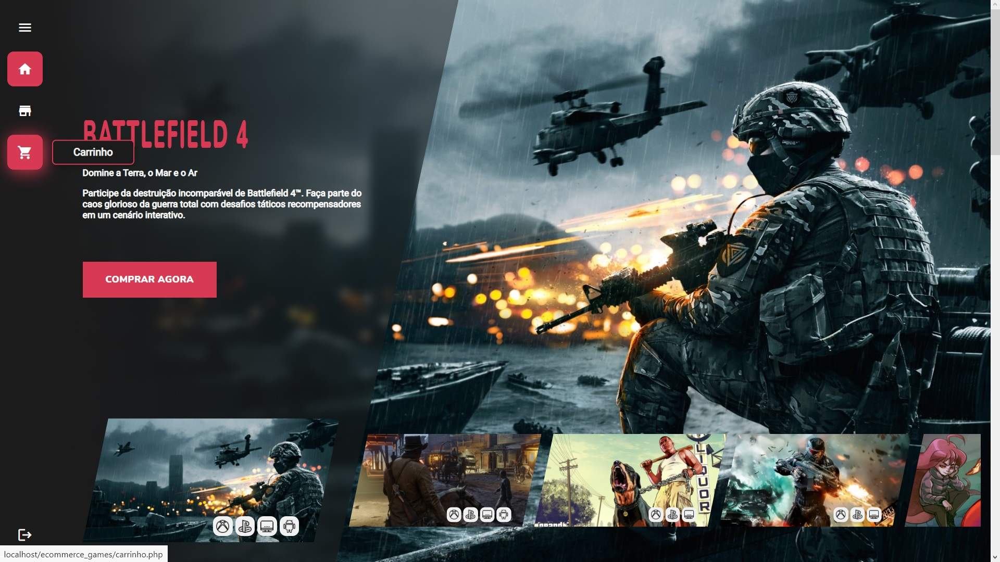
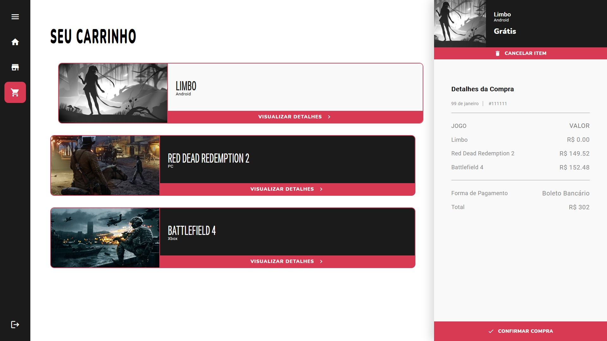

<h1>E-commerceGames</h1>

  <h2>Sumário</h2>
    <ul>
      <li><a href="#sobre">Sobre</a></li>
      <li><a href="#requisitos">Pré-requisitos</a></li>
      <li><a href="#instalacao">Rodando a aplicação</a></li>
      <li><a href="#galeria">Galeria</a></li>
      <li><a href="#nota">Notas</a></li>
    </ul>
    
  <h2 id='sobre'>💬 Sobre</h2>
  
O E-commerceGames é um projeto que demorou 2 meses para ser produzido e mais de 1 mês só para ser planejado. Este website consiste em uma loja virtual para venda dos mais novos jogos lançados para as plataformas: PC, XBox, Playstation, Switch e Android.

  
Todo o conteúdo contido no e-commerce é fictício, justamente por ser um projeto de estudo. Resolvi desenvolvê-lo para colocar em prática os conhecimentos que estava adquirindo enquanto estudava mais sobre PHP.

  
Como desenvolvi com a ajuda de meu irmão gêmeo, nós resolvemos dividir as tarefas, ele ficou responsável pela produção do front-end e eu pela produção do banco de dados e do back-end (mesmo que tenhamos nos ajudado muito enquanto desenvolvíamos, seguimos mais ou menos essa divisão de tarefas).

  
Como produto final vê-se um website moderno, com estilo "gamer" contendo várias funcionalidades que tornam o projeto ainda mais prazeroso de desfrutar.

  
  <h2 id='requisitos'>🧩 Pré-requisitos para rodar a aplicação</h2>
  
Tenha certeza de que seu dispositivo tem o xampp instalado, senão instale-o no link:

  <ul><a href="https://www.apachefriends.org/pt_br/download.html">https://www.apachefriends.org/pt_br/download.html</a></ul>
  
Após a instalação do xampp, siga os seguintes passos para importar o banco de dados:

  <ul>
    <li>Abra o XAMPP Control Panel em seu dispositivo;</li>
    <li>Inicie o Apache e o MySQL;</li>
    <li>Em seu navegador, entre no link "localhost/phpmyadmin";</li>
    <li>Crie um novo banco de dados chamado "bd_ecommerce_games";</li>
    <li>Na parte superior da página, clique em "Importar";</li>
    <li>Clique no botão "Procurar..." e selecione o banco de dados localizado na Pasta "..\E_commerceGames-master\bd\bd_ecommerce_games.sql" do arquivo baixado;</li>
    <li>Desça a página e clique no botão "Executar".</li>
  </ul>
  
  <h2 id='instalacao'>🚀 Rodando a Aplicação</h2>
  
  
Depois de configurar o Banco de dados em sua máquina, mova a pasta raiz do projeto para a pasta "htdocs" do Xampp, localizada por padrão em "C:\xampp\htdocs\" e, em seguida, abra o link "localhost/E-commerceGames-master" em seu navegador.

  
Tudo pronto! O projeto já estará rodando no localhost de seu dispositivo, agora é só aproveitar e vizualizar todos os recursos presentes nele.

  
  <h2 id='galeria'>🖼 Galeria</h2>
  
Página inicial - Deslogado

  
  
  
  
  
Página inicial - Logado

  
  
  
Loja de jogos

  
  
  
  
  
Login e Cadastro

  
  
  
  
Carrinho

  
  
  
  <h2 id='nota'>📃 Notas</h2>
  
Projeto feito somente para computadores, portanto não foi adicionado o recurso "Responsivo" para estilização de redimencionamento do conteúdo, porém, em uma data posterior adicionarei este recurso.

  
Projeto feito exclusivamente para estudos, ou seja, sem visar nenhuma forma de lucro.

  
Projeto realizado com a ajuda de Robert da Silva Gomes (GitHub: <a href="https://github.com/RobertSGomes/">RobertSGomes</a>).

  
Este projeto tem uma versão traduzida para a biblioteca React. (<a href="https://github.com/RogerSGomes/E-commerceGames-React">E-commerceGames-React</a>)

